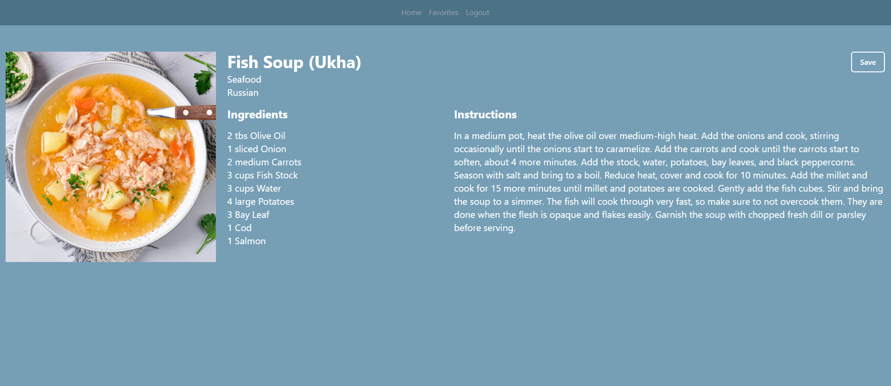
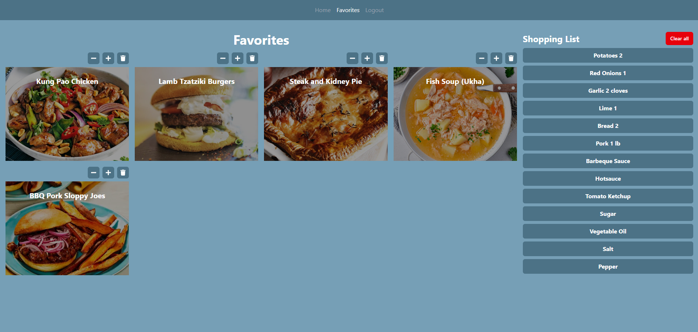

# Recipe Finder

## Overview
A simple React + Tailwind CSS app to search recipes, view details, and save favorites.Built as part of my portfolio to practice API integration and Supabase authentication.

## Demo

[Live Demo](https://find-recipe-now.vercel.app/)

## Screenshots

### Homepage


### Recipe Details


### Favorites



### Login Page


## Features
- Search recipes from a public API
- View detailed ingredients & instructions
- User authentication with Supabase
- Save recipes to favorites
- Generate shopping list from saved recipes
- Fully responsive (mobile + desktop)


## Tech Stack
- React (with Vite)
- Supabase (Auth + DB)
- Tailwind CSS
- The Meal DB
- Deployed on Vercel

## Installation
1. Clone the repository:
   ```bash
   git clone https://github.com/teodorTodrovT/recipe-finder.git
   ```
2. Navigate into the project folder:
   ```bash
   cd recipe-finder
   ```
3. Install dependencies:
   ```bash
   npm install
   ```
4. Run the development server:
   ```bash
   npm run dev
   ```

## Next Steps
- Fix: None
- Add: None
- Improve: None


